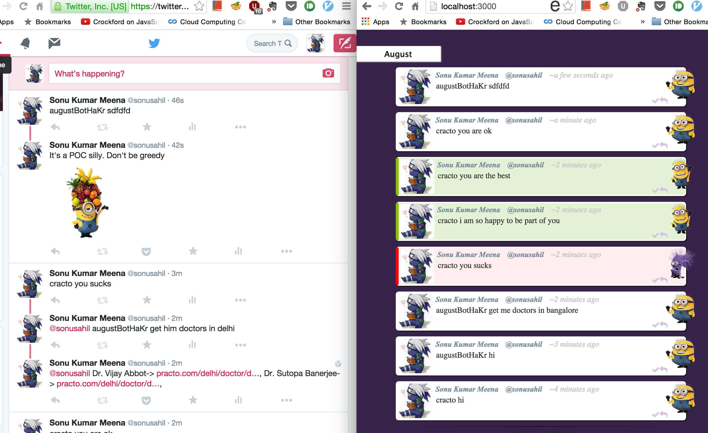

Instructions
----

- Edit configuration and add api keys'

        vim config/default.json

- Edit for botname in `config/default.json` file
- Edit keywords to track on twitter in `twitter.js:58`
- Install dependencies

        npm install

- Start server

        npm start

Example
-----

Assuming default botname and keywords

        augustBotHaKr get me doctors in bangalore

Screenshot
-----

Sorry, wrong one.. :P

LICENSE
------

MIT
